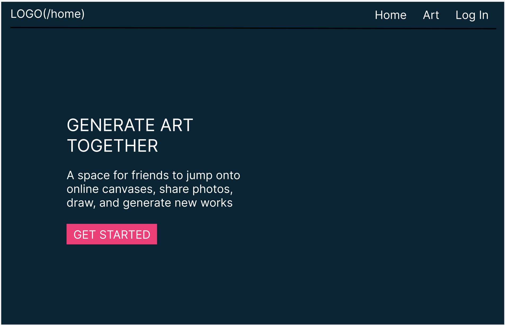
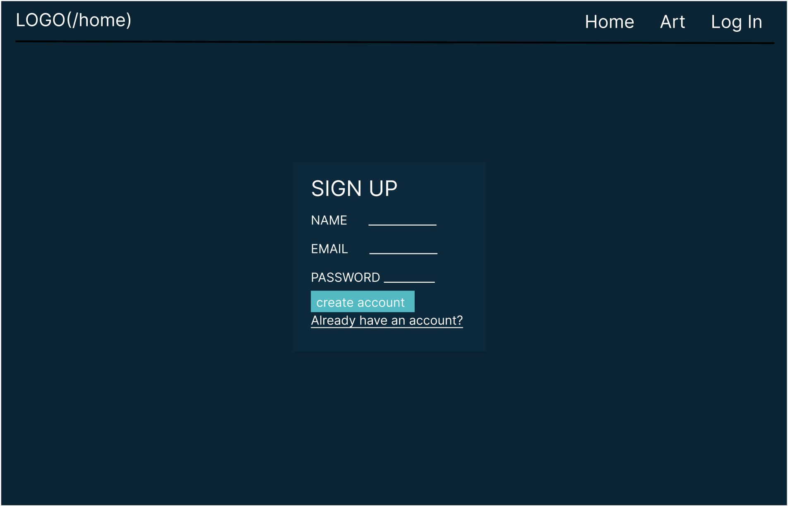
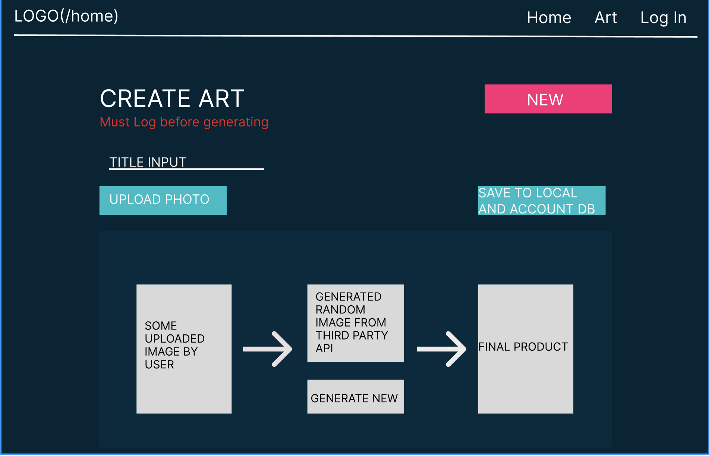
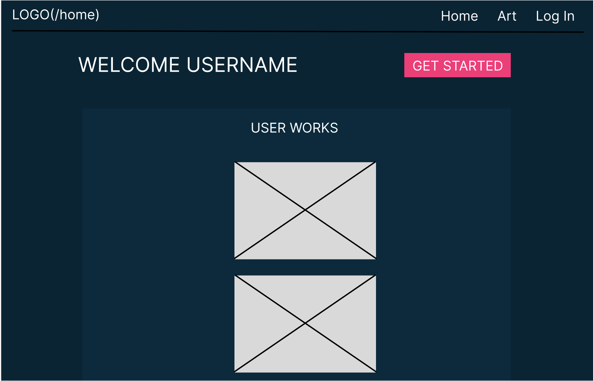

# ArtGen
A space to upload and save photos. Future versions will incorporate art generators that will allow for image modification.

## Deployed Application through Firebase
[Artgen](https://artgen-0.web.app/)

## Technologies Used
- React JS
- Firebase (Authentication, Storage, Firestore Database, and Hosting)

## Installation instructions
- npm i or yarn install, to install all dependencies located in package.json
- This application uses firebase for all backend functions, look up how to initialize Firebase [here](https://firebase.google.com/docs/web/setup)

## Application Features
- Able to upload and store user images 
- Sign up and login pages for new and current users
- Full CRUD on User

## Approach Taken towards MVP and Completion
During the initial stages of planning, I was eager to create an application that would allow a user to generate new art works using photos of their choice. At this stage I was still thinking of using either a MERN or PERN stack, but with the requirement of storing images as file data I had to find an alternative Database. This led me using a FRN (Firebase, React, NodeJS) stack for my application. Learning the unfamiliar stack was a ambitious initiative that brought along many headaches but that I'm ultimatley happy that I took. Although, learning the new tech was time consuming and took away some possibilities from my initial goal for the application. I was still able to complete an application that met my MVP goals. The current application does not have the Art Generator that I wanted when I first proposed this project but it does have the foundation to apply such a feature for when I continur=e to work on this project at a later time.

## Unsolved Problems and Hurdles
Firebase was the beginning and end to all my major road blocks. Learning a new stack, FRN, was an endevor that I knew was going to be difficult, but I also knew that with so many resources to guide me it would be an accomplishable task. Picking the right resources turned out to be crucial for completing this application. Some tutorials or how to's can be misleading or not conducive in practice and this led me to trying a myriad of ways to accomplish one thing. Such as authorization, Firebase is definitely an appreciated crutch when it comes to authorization, but how you choose to incorporate the feature into the application can vary and really depends and how you want you're final product to interact with the user, for example, whether you wish to use private routes or not. 

## User Stories:
- As an art admirer, I want to view new art in an uncomplicated and easy accessible way.
- As an artist I like to explore new mediums, an art generator that is randomized allows for new possibilities.
- As a bored kid, I like to browse and find new interesting things on the web, creating new pieces of art or editing images online is a fun way to keep distracted and entertained.
- As a photographer, I'd like a place to store my photos that I can have access to as long as I have wifi.

### Wireframes: 
# 
# 
# 
# 

## Stretch Goals
- Art genarator(s) to allow modification to user images 
- Full CRUD by user only, on user images
- More global styling for page compatibility 
